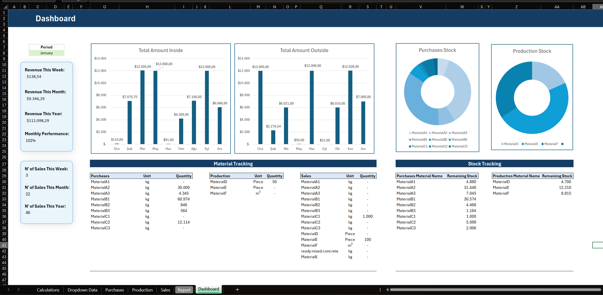
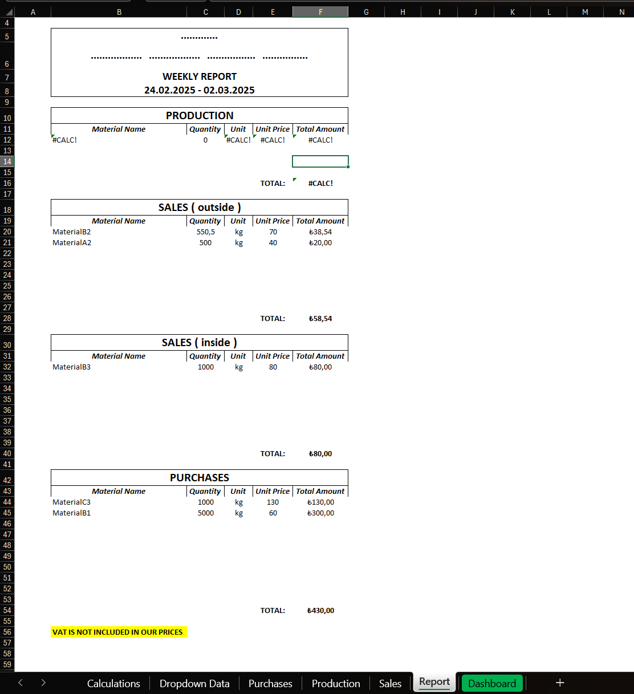
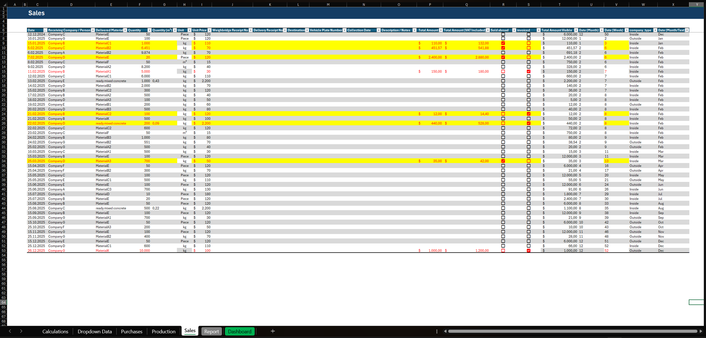
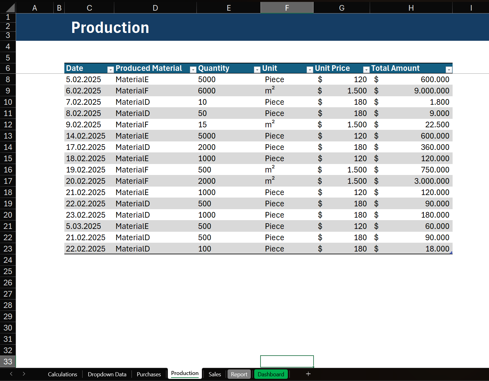
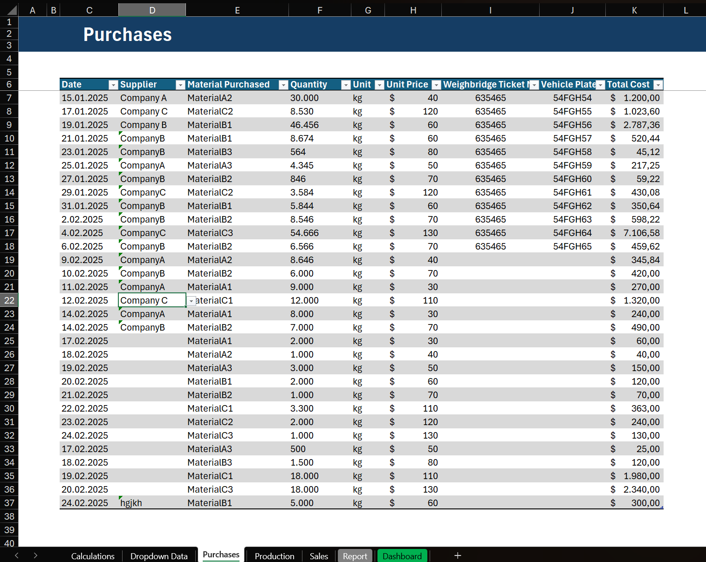
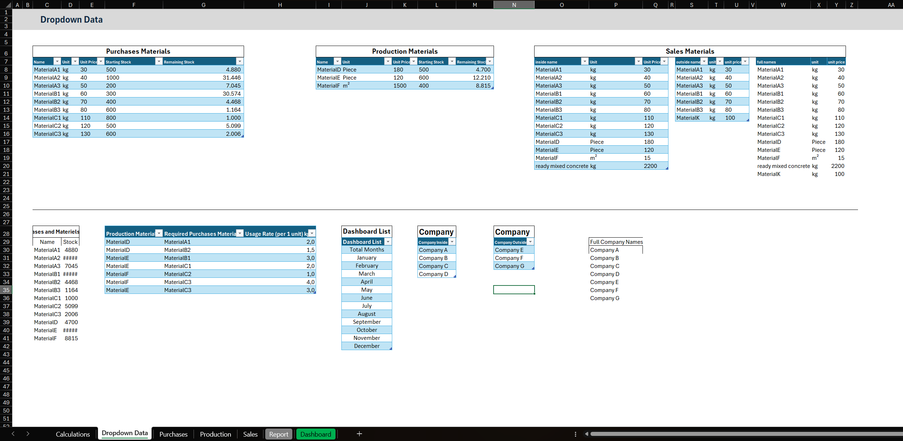

# What is this dashboard for and for whom?

This dashboard provides business owners, sales managers, and financial analysts with insights into sales performance, production efficiency, and financial trends. It helps visualize key metrics, identify revenue patterns, monitor costs, and optimize decision-making for better market positioning.

### 🔥 Key Benefits
This Excel Product Manager Dashboard offers several advantages for businesses and individuals managing product stock and sales efficiently:

- **Comprehensive Product Tracking** – Keep an accurate record of stock levels, sales, and inventory movements in real time.
- **Time-Saving Automation** – Automates calculations, updates, and visualizations, reducing manual data entry and minimizing errors.
- **Insightful Data Visualization** – Provides easy-to-understand charts and tables for quick decision-making and performance analysis.
- **Dynamic Filtering & Customization** – Allows users to filter data dynamically and customize reports based on business needs.
- **Sales & Revenue Monitoring** – Tracks sales trends, revenue generation, and profit margins to optimize business performance.
- **User-Friendly Interface** – Designed with simplicity in mind, ensuring accessibility for both beginners and advanced Excel users.

This dashboard serves as a powerful tool for business owners, product managers, and analysts looking to streamline their inventory and sales processes.

# 🎨 User Interface & User Experience (UI/UX)

This Excel Product Manager Dashboard is designed with a clean and intuitive user interface to enhance usability and efficiency.

### 🏗 Core Components of the Dashboard

The dashboard consists of several key sections that provide seamless data visualization and management:

- ### Dashboard
    
    - **Main Dashboard**  
    A high-level overview displaying key metrics such as total stock, sales trends, and revenue.
    - **Stock Management Table**  
    A structured table to track product inventory, including stock levels, reorder alerts, and supplier details.
    - **Sales Performance Panel**  
    Provides insights into sales volume, best-selling products, and revenue comparisons. (*Moreover, the graphs of external sales and internal sales can be given separately. Because the sales_type is automatically written in a hidden column on the sales page according to the company name selected in that row, and the graphs can be separated by filtering according to type.*)
    - **Dynamic Filtering Panel**  
    Allows users to apply filters by product category, date, or custom criteria for more precise analysis.

- ### Report
    
    - **Working logic**  
    The day range of the current week is automatically calculated on the report page. And that week's purchases, production, domestic and foreign sales are brought together with their important titles.  
      
        If there is no data entry for that week, it gives a #CALC! error. Of course, if there is a warning message that you want to print simply from the formula in the cell, you can print it.
    - **Best Part**  
    The best part about this page is that you don't even have to touch it in any way. It can automatically give you a weekly report.

- ### Sales
    
    
    - **Working logic**  
    The **Sales** page is designed to systematically record and track all sales transactions. It provides an organized structure to capture essential sales details, such as the date, customer, material name, quantity, unit, price, and total amount. The logic behind this page ensures that sales data is efficiently recorded, analyzed, and used for reporting.
    
    - **Automated Weekly and Monthly Tracking**  
    Each sale entry is automatically assigned a Week Number and Month based on the sale date. This allows for seamless weekly and monthly reporting in the dashboard and report sections.

    - **Highlighted Lines**  
    There are two different checkboxes on this page. One is to mark it as sold out and the other is to mark it as invoiced.

    - **Best Part**  
    One of the best parts is that as soon as you select the material you want to sell, the unit and unit price of that material are automatically displayed. I know it's a very simple automation, but I had no idea it would make life this easy.

- ### Production
    
    
    - **Working logic**  
    You can enter data by selecting the products specified for production on the dropdown data page.

- ### Purchases
    
    
    - **Working logic**  
    Similarly, data entry can be provided by selecting company names and material names from the list. Also, you do not have to select the company name from the list, you can write it there manually.

- ### Dropdown Data
    
    
    - **Working logic**  
    Almost all dropdown lists pull their data from the tables on this page. You can change many data information such as material name, unit, unit price and starting stock.  

    - **Best Part**  
    At the same time, many data sets that we pull to the dashboard page are also automatically collected on this page.

### 📊 Graphs, Tables, and Visuals Used

To enhance data representation and ensure quick decision-making, the dashboard includes:

- **Bar Charts** – Display sales trends and product performance over time.
- **Pie Charts** – Provide a breakdown of stock distribution across different categories.
- **Line Charts** – Track revenue growth and fluctuations over selected time periods.
- **Conditional Formatting** – Highlights critical values such as low stock alerts or top-performing products.
- **Pivot Tables** – Allow dynamic reporting and data aggregation for customized insights.

### 🛠 User-Friendly Design & Enhancements

The dashboard is designed with usability in mind to ensure a smooth experience for all users:

- **Minimalist Layout** – A clean and organized structure that avoids clutter and enhances readability.
- **Automated Updates** – Reduces manual work by refreshing data automatically when changes occur.
- **Color-Coded Indicators** – Uses intuitive color schemes to differentiate between stock levels, sales performance, and alerts.
- **Easy Navigation** – Logical arrangement of sections to improve workflow and access to critical insights.
- **Dropdown Selections** – Users can select specific products, time ranges, or categories for a personalized view of data.

This user-friendly design ensures that both beginners and advanced users can efficiently track products, manage stock, and analyze sales data with ease.

# Usage Guide

# What I Learned

Throughout this adventure, I've turbocharged my SQL toolkit with some serious firepower:

- **🧩 Complex Query Crafting:** Mastered the art of advanced SQL, merging tables like a pro and wielding WITH clauses for ninja-level temp table maneuvers.
- **📊 Data Aggregation:** Got cozy with GROUP BY and turned aggregate functions like COUNT() and AVG() into my data-summarizing sidekicks.
- **💡 Analytical Wizardry:** Leveled up my real-world puzzle-solving skills, turning questions into actionable, insightful SQL queries.

# Conclusions

### Insights
From the analysis, several general insights emerged:

1. **Top-Paying Data Analyst Jobs**: The highest-paying jobs for data analysts that allow remote work offer a wide range of salaries, the highest at $650,000!
2. **Skills for Top-Paying Jobs**: High-paying data analyst jobs require advanced proficiency in SQL, suggesting it’s a critical skill for earning a top salary.
3. **Most In-Demand Skills**: SQL is also the most demanded skill in the data analyst job market, thus making it essential for job seekers.
4. **Skills with Higher Salaries**: Specialized skills, such as SVN and Solidity, are associated with the highest average salaries, indicating a premium on niche expertise.
5. **Optimal Skills for Job Market Value**: SQL leads in demand and offers for a high average salary, positioning it as one of the most optimal skills for data analysts to learn to maximize their market value.

### Closing Thoughts

This project enhanced my SQL skills and provided valuable insights into the data analyst job market. The findings from the analysis serve as a guide to prioritizing skill development and job search efforts. Aspiring data analysts can better position themselves in a competitive job market by focusing on high-demand, high-salary skills. This exploration highlights the importance of continuous learning and adaptation to emerging trends in the field of data analytics.